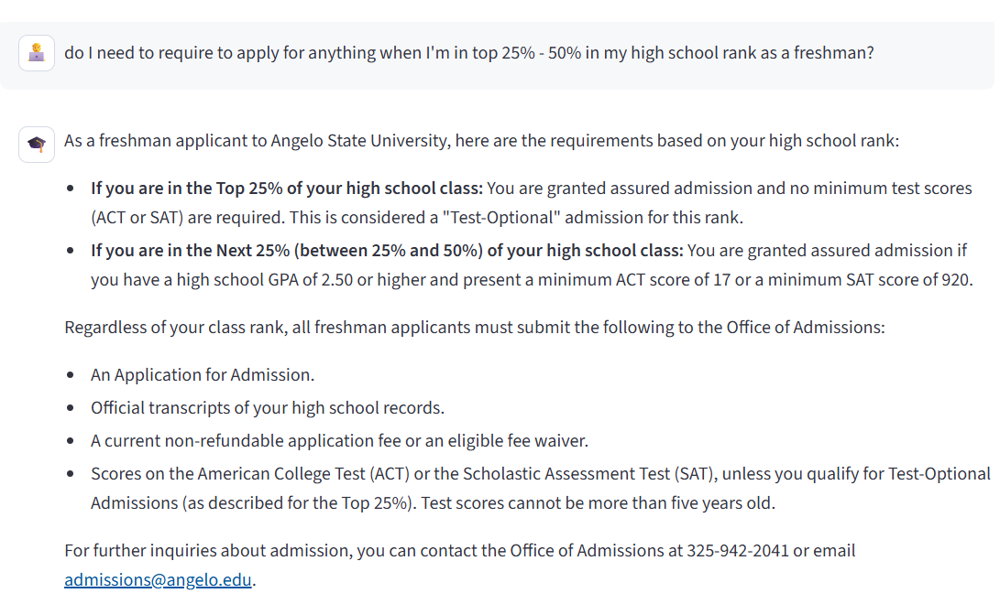
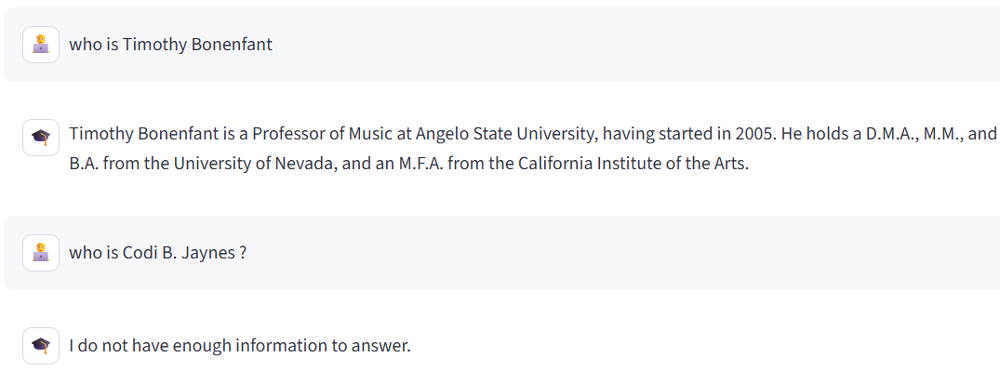

# ASU Chatbot - Frontend

This directory contains the frontend implementation for the Angelo State University Knowledge Chatbot. Built with Streamlit, it provides an interactive and responsive chat interface that communicates with the FastAPI backend.

## 🚀 Technology Stack

- **Streamlit** - Web framework for building the interactive UI
- **Docker** - Containerization and deployment
- **Python Libraries**:
  - `requests` - API communication with backend
  - `pandas` & `plotly` - Data visualization
  - `pydantic` - Settings management
  - `python-dotenv` - Environment variable handling

## 📂 Project Structure

```
frontend/
├── .streamlit/                # Streamlit configuration
│   └── secrets.toml          # Secure credentials storage
├── src/
│   ├── api_client.py         # Backend API communication
│   ├── config.py            # Configuration management
│   └── ui_components.py     # Reusable UI elements
├── pages/
│   ├── 1_About.py           # About page
│   └── 2_Data_Sources.py    # Data visualization page
├── app.py                   # Main application entry point
├── Dockerfile               # Container configuration
└── requirements.txt         # Python dependencies
```

### Key Components

1. **Main Application (`app.py`)**
   - Entry point for the Streamlit application
   - Manages chat interface and message history
   - Handles user input and bot responses

2. **Source Directory (`src/`)**
   - `api_client.py`: Manages HTTP requests to backend
   - `config.py`: Loads and validates configuration
   - `ui_components.py`: Contains reusable UI elements

3. **Pages Directory (`pages/`)**
   - Additional pages for the multi-page Streamlit app
   - About page with project information
   - Data Sources page with Neo4j statistics

4. **Docker Configuration**
   - Multi-stage build process
   - Development and production configurations
   - Runs on port 8501
   - Includes health checks

## 🔌 Backend Communication

The frontend communicates with the backend through these endpoints:

- **Chat Endpoint**: `POST http://localhost:8000/api/v1/chat`
  - Sends user messages
  - Receives AI-generated responses
  - Handles conversation context

## 🐳 Docker Support

The frontend includes a production-ready Dockerfile with:
- Multi-stage build for optimization
- Non-root user for security
- Health checks
- Environment variable support

To build and run with Docker:

```bash
# Create .streamlit/secrets.toml
# frontend/.streamlit/secrets.toml

[server]
enableCORS = false
headless = true
port = 8501
address = "0.0.0.0"

[neo4j]
uri = "bolt://host.docker.internal:7687"
user = "neo4j"
password = "12345678"
database = "chatbot-database"

[frontend]
PROJECT_NAME = "asu_chatbot"
API_BASE_URL = "http://host.docker.internal:8000/api/v1"
FRONTEND_PORT = 8501

# Build the container
docker build -t asu-chatbot-frontend .

# Run the container
docker run -p 8501:8501 `
-v "<your .streamlit file path>:/app/.streamlit" `
frontend
```

## ⚙️ Local Development Setup

1. **Environment Configuration**

```bash
# Create .streamlit directory
mkdir .streamlit

# Create secrets.toml
# frontend/.streamlit/secrets.toml

[server]
enableCORS = false
headless = true
port = 8501
address = "0.0.0.0"

[neo4j]
uri = "bolt://localhost:7687"
user = "neo4j"
password = "12345678"
database = "chatbot-database"

[frontend]
PROJECT_NAME = "asu_chatbot"
API_BASE_URL = "http://localhost:8000/api/v1"
FRONTEND_PORT = 8501
```

2. **Install Dependencies**

```bash
# Create virtual environment
python -m venv venv

# Activate (Windows)
.\venv\Scripts\activate

# Install requirements
pip install -r requirements.txt
```

3. **Run the Application**

```bash
# Start Streamlit server
streamlit run app.py
```

The application will be available at `http://localhost:8501`

## 🔒 Security Features

- Secure credential management via `secrets.toml`
- CORS protection
- Environment variable validation
- Non-root Docker user
- Sanitized user inputs

## 📚 Documentation

- Interactive components documentation in the About page
- API documentation available in the backend
- Inline code documentation for maintainability in the frontend
```

## Example of a chat session

